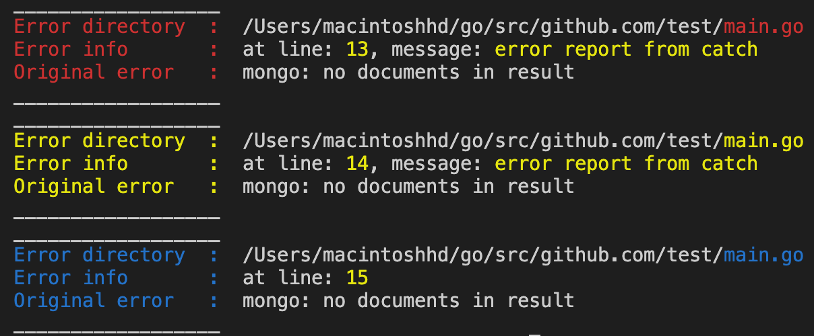
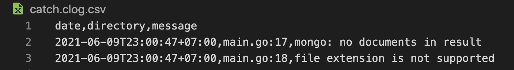

# _Catch_
__*catch*__ is a simple logging package that colorizes logs to help you read errors more easily and less frustrating.

# Install:

    go get github.com/abuabdillatief/catch

# Examples:

    type PrintType string

    const (
        TypeError PrintType = "Error"
        TypeWarn  PrintType = "Warn"
        TypeInfo  PrintType = "Info"
    )
## Simple logging
  	err := errors.New("mongo: no documents in result")
	err2 := errors.New("file extension is not supported")
	m := "error report from catch"

    //create a new instance with our log file name
	c := catch.NewLog("catch")

    //call log functions
	c.Error(err, m)
	c.Warn(err, m)
	c.Inform(err)

## Custom logging
    customLog := make(map[string]string)
	
	customLog["start"] = "0"
	customLog["end"] = "15"

	c.CustomLog(customLog, catch.TypeError)
	c.CustomLog(customLog, catch.TypeWarn)
	c.CustomLog(customLog, catch.TypeInfo)

    

## Save and Delete log file

    //save logs to predefined file which is "catch"
	c.SaveToLogFile(err)
	c.SaveToLogFile(err2)
After saving log file, file will look like this:

To delete log file, simply call:

    c.DeleteLogFile()

# Credits
- [Color by fatih](https://github.com/fatih/color)

