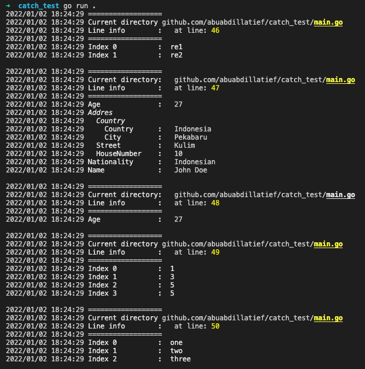

# _Catch_
__*catch*__ is a simple logging package which helps you read errors more easily and less frustrating. Many more features are to be developed in the future, do contribute if you will, thank you 

# Install:
    go get github.com/abuabdillatief/catch@latest

## Simple logging
	type Student struct {
		Name        string
		Age         int
		Addres      Address
		Nationality string
	}

	type Address struct {
		Country     CountryDetail
		Street      string
		HouseNumber int64
	}

	type CountryDetail struct {
		Country string
		City    string
	}

	func main() {
		a := Student{
			Addres: Address{
				Country: CountryDetail{
					Country: "Indonesia",
					City:    "Pekabaru",
				},
				Street:      "Kulim",
				HouseNumber: 10,
			},
			Age:         27,
			Name:        "John Doe",
			Nationality: "Indonesian",
		}
		catch.PrintStruct(a)
	}
#### Result

# Credits
- [Color by fatih](https://github.com/fatih/color)

